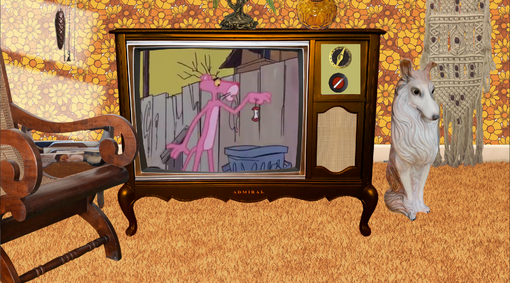
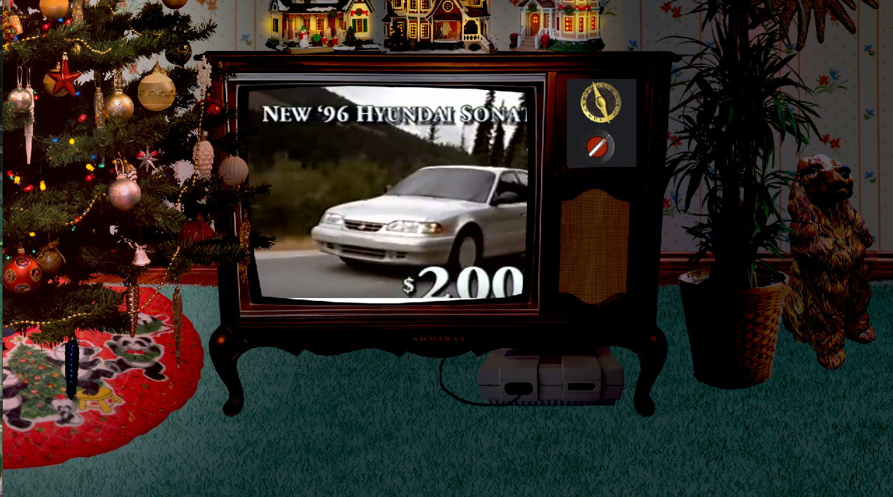
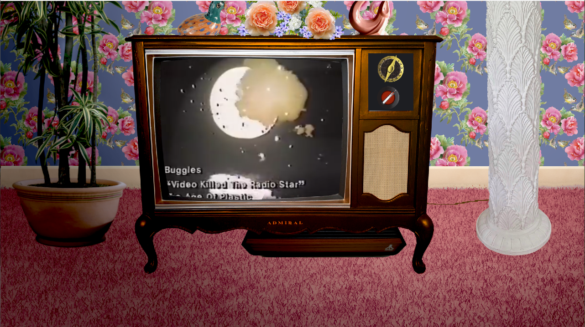

## NostalgiaBox - Cozy TV at Grandma's

# What is this?
It's a media viewer intended to bring the user back to the comfy cozy comforts of childhood.

# How would it do that? 
The user is able to select a general time period (70s, 80s, or 90s), a time of day (morning, noon, or night), and as this project was created in December 2022, a choice between Christmassy or not Not Christmassy.

With the choices made the user is presented with a living room decked out in the decade of their choice, with or without Christmas decorations, and set appropriately to the choisen time of day.

There stands a large, old console TV in the center of the space, and (when the API cooperates) a click of the power knob brings up period-appropriate television on a random channel. Turn the channel dial, and a different show comes up.  Turn back to the first channel, and you'll find you've missed out on what you were watching!

# But like, how does it do all that?
The program utilizes WebView to project YouTube videos behind the TV screen. The videos are members of curated arrays, separated by decade and holiday content, and a random video is pulled up on clicking the power knob.  With each click of the channel knob, the timestamp is pushed forward 5 seconds to simulate time passing, so you'll theoretically never see the same thing twice.  This doesn't address watching watching a video longer than 5 seconds, however - after going through all the "channels", you'll likely find youself at a point you've already seen.  This is due to using WebView rather than the dedicated YouTube viewer, meaning that current watch time was impossible (or at least more difficult) to find.

# Requirements
As this program was written as part of a Java class, it uses outdated tech for simplicity of understanding. To run it, I recommend using NetBeans 8.2 with JDK 8. It also requires an internet connection and access to YouTube.

